# feat: add review home re-entry and issue workbench

## Overview

Close the demo workflow after manual review. When a reviewer approves an `awaiting_review` task, the app should return to the home page, expand the inspection module once, and show a dedicated issue/sign-off badge. From there, users should enter a new `/issue-tasks` workspace that mirrors the current review workbench grammar but focuses on final release: full task detail, raw-data preview, richer AI verification, and a final sign-off action that moves the task into a terminal `issued` state.

## Problem Frame

The approved design in `docs/plans/2026-04-21-review-home-issue-workbench-design.md` identified two hard breaks in the current demo flow:

- review approval updates the task to `awaiting_issue` but leaves the user stranded on the review page
- the issue card on the home screen is only copy, not a real workflow entry point

That matters because the current demo tells the user "the task is ready for issue" without giving them a visible next step. The result is a fake end-to-end flow, not a real one. The plan needs to preserve the existing inspection pipeline, reuse current UI grammar, and add the smallest set of surfaces required to make sign-off feel like a real business node rather than a placeholder.

## Requirements Trace

- R1. Approving a review task returns the user to `/` with a one-shot inspection signal that expands the inspection module and highlights pending issue work.
- R2. Home reminder logic surfaces `awaiting_issue` separately from `pending_claim`, `awaiting_raw_data`, and `awaiting_review`.
- R3. The inspection module exposes a real sign-off entry route, `/issue-tasks`.
- R4. The sign-off workspace shows an `awaiting_issue` queue on the left and full selected-task details on the right.
- R5. The right pane includes task-order metadata, original raw-data preview, the existing AI review summary, and a new sign-off AI review stage.
- R6. Sign-off AI review checks at least: standards math consistency, sample-count suitability, equipment suitability, and standard-reference accuracy.
- R7. Final sign-off transitions the task out of `awaiting_issue` into a terminal `issued` state so it disappears from home badges and issue queues.

## Scope Boundaries

- No role or permission model changes. Demo auth remains as-is.
- No report export, PDF generation, or archival UI for issued tasks.
- No real external standards engine. Sign-off AI remains a mocked but structured workflow.
- No attempt to merge review and issue into a single page.
- No React component test framework introduction. Keep tests in the current `node:test` style around pure helpers and state/builders.

## Context & Research

### Relevant Code and Patterns

- `src/app/review-tasks/page.tsx` already provides the left-queue/right-decision workbench pattern the issue page should mirror.
- `src/app/review-tasks/review-tasks.css` establishes the exact visual grammar for headers, panes, cards, badges, and action rows.
- `src/app/inspection-tasks/page.tsx` already contains the richer staged AI-review presentation used during raw-data review. The issue page should reuse that interaction model rather than invent a second "AI process" style.
- `src/lib/inspection-ai-review.ts` is the existing pattern for building deterministic trace + summary review narratives.
- `src/app/home/inspection-task-reminder.ts` currently only models task and review reminders. It is the natural extension point for issue badges.
- `src/components/CapabilityCards.tsx` already supports multiple module-level badges. It needs one more prop rather than a redesign.
- `src/lib/entrust-store.ts` already uses runtime schema evolution plus dedicated persistence helpers for raw-data and review stages. That same pattern should be reused for sign-off state and, if retained, sign-off AI metadata.
- `src/app/api/inspection-tasks/[taskId]/route.ts` only supports `DELETE`. There is no current detail GET surface for raw-data preview or review metadata, which is why the new issue page cannot rely solely on `getInspectionTasks()`.
- `src/lib/entrust.ts` and `src/lib/api.ts` currently stop the shared status model at `awaiting_issue`.

### Institutional Learnings

- Prior approved design `docs/plans/2026-04-21-review-home-issue-workbench-design.md` already settled the product shape: review returns home, home shows an issue badge, issue gets its own page.
- Prior approved design `docs/plans/2026-04-20-home-inspection-task-badge-implementation.md` established the one-shot `inspectionSignal` pattern for home re-entry. Reuse that instead of inventing a second mechanism.
- Prior approved design `docs/plans/2026-04-20-inspection-workbench-review-flow-implementation.md` established the workflow split between raw-data entry, review queue, and status progression. This plan extends that same chain one node further.

### External References

- External workflow research during planning reinforced a consistent pattern: approval systems work best when queue ownership is explicit, validation criteria are visible, and "next step" reminders are surfaced on the home/dashboard layer rather than hidden inside the previous step’s page.
- No external product or framework dependency was chosen from that research. It shaped UX direction, not implementation mechanics.

## Key Technical Decisions

- Add a terminal `issued` task status instead of leaving successfully signed tasks in `awaiting_issue`. This is the only clean way to make badges, queues, and workbenches converge.
- Keep list and detail payloads separate. `getInspectionTasks()` should remain lightweight for cards and reminders. A new detail GET surface should serve raw-data preview and other sign-off-only fields for the selected task.
- Reuse the existing `inspectionSignal` home-return pattern and extend it with an `issue` value instead of adding a second URL flag or storage mechanism.
- Build sign-off AI review as a sibling to raw-data AI review, not as an overloaded variation of the existing inspection AI route. The checks and user intent are different.
- Gate final sign-off on a successful sign-off AI review in the UI and validate the task status server-side. For demo scope, whether the server also persists a "sign-off AI passed" flag is an implementation detail, but the state transition itself must remain authoritative.
- Keep the issue page visually parallel to the review page, but structurally closer to the inspection workbench’s right pane. This prevents a second "comment-first" interface.

## Open Questions

### Resolved During Planning

- How should the sign-off page get full raw-data content?
  - Resolution: add a dedicated detail GET for `src/app/api/inspection-tasks/[taskId]/route.ts` rather than bloating the list DTO returned by `/api/inspection-tasks`.
- Should sign-off be a mode of the review page or a new route?
  - Resolution: new route, `/issue-tasks`, to preserve clean workflow boundaries and demo storytelling.
- How should completed sign-off tasks leave the system?
  - Resolution: transition to a new terminal `issued` status, hidden from all active queues and badges.

### Deferred to Implementation

- Whether sign-off AI results need dedicated persistence columns (`issue_review_*`) or can be treated as recomputable transient UI state for the demo. The plan covers both possibilities; implementation can choose the lighter path if UI gating remains reliable.
- Whether the final sign-off step needs a free-text sign-off comment in v1. The current design does not require it.
- Whether `/issue-tasks` should optimistically preload the first queue item’s detail or wait for explicit card selection.

## High-Level Technical Design

> *This illustrates the intended approach and is directional guidance for review, not implementation specification. The implementing agent should treat it as context, not code to reproduce.*

```mermaid
flowchart LR
  A[inspection-tasks submit] --> B[awaiting_review]
  B --> C[review-tasks approve]
  C --> D[awaiting_issue]
  D --> E[redirect to /?inspectionSignal=issue]
  E --> F[home inspection module expands]
  F --> G[user opens /issue-tasks]
  G --> H[selected task detail GET]
  H --> I[sign-off AI review]
  I --> J[confirm sign-off]
  J --> K[issued]
  K --> L[home/reminders/queues no longer show task]
```

The list/detail split is intentional:

- `/api/inspection-tasks` remains the shared lightweight queue source for home, review, and workbench lists
- `/api/inspection-tasks/[taskId]` becomes the selected-task detail source for issue workbench rendering

## Implementation Units

- [ ] **Unit 1: Extend workflow state and reminder surfaces for issue/sign-off**

**Goal:** Add `issued` to the shared workflow model, expose an issue-specific home badge, and ensure active reminder logic includes `awaiting_issue` but excludes `issued`.

**Requirements:** R1, R2, R7

**Dependencies:** None

**Files:**
- Modify: `src/lib/entrust.ts`
- Modify: `src/lib/api.ts`
- Modify: `src/app/home/inspection-task-reminder.ts`
- Modify: `src/app/home/HomeWelcome.tsx`
- Modify: `src/components/CapabilityCards.tsx`
- Test: `src/lib/entrust.test.ts`
- Test: `src/app/home/inspection-task-reminder.test.ts`

**Approach:**
- Extend the shared task status union to include `issued`.
- Keep `buildInspectionTask()` mapping `awaiting_issue` as active and hide `issued` from active list/reminder surfaces by treating it as a terminal completed state.
- Expand home reminder derivation so it returns a dedicated `issueBadge` alongside the existing task and review badges.
- Update `HomeWelcome` to parse a third one-shot signal value, `issue`, and pass a new issue badge down to `CapabilityCards`.
- Add a dedicated issue badge prop rather than reusing the review badge channel, so the visual logic stays explicit.

**Patterns to follow:**
- `src/app/home/inspection-task-reminder.ts` for count/status derivation
- `src/components/CapabilityCards.tsx` for module-level badge plumbing
- `src/lib/entrust.ts` for workflow-state labeling

**Test scenarios:**
- Happy path: a newest `awaiting_issue` task produces an `issueBadge` with count and `待签发` label.
- Happy path: `awaiting_issue` contributes to the top-level inspection badge count and status when it is the newest active inspection task.
- Edge case: `issued` tasks do not appear in task, review, or issue badge counts.
- Edge case: mixed tasks where `awaiting_review` and `awaiting_issue` coexist keep their dedicated module badges separate.
- Integration: status normalization accepts persisted `issued` values without regressing prior states.

**Verification:**
- Home reminder helpers can distinguish task, review, and issue queues correctly.
- The inspection module can render a dedicated sign-off badge without affecting existing task/review badge behavior.

- [ ] **Unit 2: Wire review approval to home re-entry and sign-off discovery**

**Goal:** Turn review approval into an explicit handoff to the next workflow node instead of leaving the user on the review page.

**Requirements:** R1, R2, R3

**Dependencies:** Unit 1

**Files:**
- Modify: `src/app/review-tasks/page.tsx`
- Modify: `src/app/review-tasks/review-actions.ts`
- Test: `src/app/review-tasks/review-actions.test.ts`

**Approach:**
- Keep the approval API semantics intact, `awaiting_review -> awaiting_issue`, but change the page behavior after success to navigate to `/?inspectionSignal=issue`.
- If needed for testability, expand `review-actions.ts` with a small pure helper that derives the post-approval redirect target from the updated task state.
- Remove success-state copy that assumes the reviewer will stay on the page, since the point is now to return to home and let the inspection module advertise the issue queue.

**Patterns to follow:**
- `src/app/home/HomeWelcome.tsx` query-signal clearing behavior
- `src/app/review-tasks/page.tsx` existing load/approve action flow

**Test scenarios:**
- Happy path: review approval on an `awaiting_review` task resolves to a home redirect with `inspectionSignal=issue`.
- Edge case: non-issue states do not produce the sign-off redirect.
- Error path: failed approval keeps the user on the review page and preserves error rendering behavior.
- Integration: after approval, the updated task state is `awaiting_issue`, which matches the home badge logic introduced in Unit 1.

**Verification:**
- Approving a review no longer leaves the user stranded on `/review-tasks`.
- The home page becomes the visible transition point into sign-off.

- [ ] **Unit 3: Add inspection task detail and sign-off review server surfaces**

**Goal:** Provide a selected-task detail payload and dedicated sign-off review/sign-off endpoints so the issue workbench can render full data and execute the final workflow transition.

**Requirements:** R4, R5, R6, R7

**Dependencies:** Unit 1

**Files:**
- Modify: `src/lib/entrust.ts`
- Modify: `src/lib/api.ts`
- Modify: `src/lib/entrust-store.ts`
- Modify: `src/app/api/inspection-tasks/[taskId]/route.ts`
- Create: `src/lib/inspection-issue-review.ts`
- Create: `src/lib/inspection-issue-review.test.ts`
- Create: `src/app/api/inspection-tasks/[taskId]/issue-review/route.ts`
- Create: `src/app/api/inspection-tasks/[taskId]/issue-complete/route.ts`
- Test: `src/lib/entrust.test.ts`

**Approach:**
- Introduce a richer detail shape, for example `InspectionTaskDetail`, that includes the existing list fields plus raw-data preview JSON, review comment/timestamp, and any sign-off review metadata needed by the UI.
- Extend `GET /api/inspection-tasks/[taskId]` to return that detail shape for selected tasks while keeping `DELETE` behavior intact.
- Add a sign-off review helper parallel to `src/lib/inspection-ai-review.ts` that produces deterministic trace items and summary text for the four required sign-off checks.
- Add `POST /api/inspection-tasks/[taskId]/issue-review` to validate `awaiting_issue`, generate the sign-off AI result, and optionally persist sign-off review metadata if the implementation chooses the persistence path.
- Add `POST /api/inspection-tasks/[taskId]/issue-complete` to validate the task is still `awaiting_issue`, mark it `issued`, stamp any final issue metadata, and return the updated task shape.

**Execution note:** Start with pure helper tests for the sign-off narrative so the four required dimensions are locked before route wiring.

**Patterns to follow:**
- `src/lib/inspection-ai-review.ts` for mocked deterministic trace construction
- `src/app/api/inspection-tasks/[taskId]/ai-review/route.ts` for route structure and persistence handoff
- `src/lib/entrust-store.ts` runtime schema evolution and update helper pattern

**Test scenarios:**
- Happy path: detail GET for an `awaiting_issue` task includes raw-data preview and review metadata needed by the issue page.
- Happy path: sign-off AI review returns four named checks plus a final summary.
- Happy path: issue completion transitions `awaiting_issue -> issued`.
- Edge case: `issued` tasks remain normalizable and list-safe after persistence.
- Error path: issue-review rejects tasks that are not in `awaiting_issue`.
- Error path: issue-complete rejects tasks that are not in `awaiting_issue`.
- Integration: tasks marked `issued` no longer appear in active reminder/list mappings from Unit 1.

**Verification:**
- The frontend has a stable, selected-task detail source instead of guessing from card DTOs.
- The sign-off stage has dedicated API semantics rather than overloading raw-data review endpoints.

- [ ] **Unit 4: Build the issue/sign-off workspace UI**

**Goal:** Add a new `/issue-tasks` page that mirrors the review workbench grammar while centering full data and sign-off readiness instead of reviewer comments.

**Requirements:** R3, R4, R5, R6, R7

**Dependencies:** Unit 1, Unit 3

**Files:**
- Create: `src/app/issue-tasks/page.tsx`
- Create: `src/app/issue-tasks/issue-tasks.css`
- Create: `src/app/issue-tasks/issue-tasks-helpers.ts`
- Create: `src/app/issue-tasks/issue-tasks-helpers.test.ts`
- Modify: `src/app/home/HomeWelcome.tsx`

**Approach:**
- Add a dedicated page route, `/issue-tasks`, with the same header/body split as `/review-tasks`.
- Filter the left queue to `awaiting_issue` tasks only.
- Load selected-task detail via the new detail surface rather than from the list response.
- Structure the right pane into clear blocks:
  - task-order metadata
  - raw-data preview table
  - prior AI/review summary context
  - sign-off AI review flow
  - final confirm-sign-off action row
- Disable final sign-off until the sign-off AI review passes.
- Route the home module’s `inspection-issue` click to `/issue-tasks` instead of treating it as a generic quick task.

**Patterns to follow:**
- `src/app/review-tasks/page.tsx` for queue selection and page shell
- `src/app/review-tasks/review-tasks.css` for card/header/token grammar
- `src/app/inspection-tasks/page.tsx` and `src/app/inspection-tasks/inspection-workbench.css` for staged AI review rendering

**Test scenarios:**
- Happy path: helper logic selects the first `awaiting_issue` task and derives the visible queue correctly.
- Happy path: sign-off action stays disabled until the sign-off AI review result is passing.
- Edge case: empty queue state renders correctly when no `awaiting_issue` tasks exist.
- Edge case: switching selected cards reloads detail without leaking previous task detail into the new pane.
- Error path: detail-load failure leaves the queue intact and shows an error in the detail pane.
- Integration: clicking the home `inspection-issue` module leads to `/issue-tasks`.

**Verification:**
- Users can move from home reminder to a real sign-off workbench.
- The issue page makes all required data visible without repurposing the review page.

- [ ] **Unit 5: Final sign-off cleanup across workbenches and home surfaces**

**Goal:** Ensure the new `issued` terminal state disappears cleanly from all active workflows and that existing workbenches point users at the right downstream page.

**Requirements:** R2, R3, R7

**Dependencies:** Unit 1, Unit 3, Unit 4

**Files:**
- Modify: `src/app/inspection-tasks/page.tsx`
- Modify: `src/app/inspection-tasks/workbench-groups.ts`
- Test: `src/app/inspection-tasks/workbench-groups.test.ts`
- Modify: `src/app/home/inspection-task-reminder.test.ts`

**Approach:**
- Keep `awaiting_issue` visible in the inspection workbench as a read-only status with an explicit CTA to the issue page.
- Ensure `issued` is excluded from inspection workbench grouping so active task boards do not retain signed-off work.
- Align home badges, queue filters, and workbench routing so every active surface agrees on which states are actionable.

**Patterns to follow:**
- `src/app/inspection-tasks/workbench-groups.ts` for state bucketing
- existing read-only status treatment for `awaiting_review` / `awaiting_issue` in `src/app/inspection-tasks/page.tsx`

**Test scenarios:**
- Happy path: `awaiting_issue` continues to bucket into the inspection workbench’s read-only issue state.
- Edge case: `issued` tasks are excluded from all active workbench groups.
- Integration: after final sign-off, the task disappears from issue queue, inspection issue bucket, and home issue badge calculations.

**Verification:**
- Signed-off work no longer clutters any active queue.
- The overall demo workflow feels closed, not just visually complete.

## System-Wide Impact

- **Interaction graph:** review approval now affects home routing and issue queue visibility, not just task status. Issue completion affects home reminders, issue queue, and inspection workbench visibility.
- **Error propagation:** approval failures must still render on the review page; issue-detail or issue-review failures must be isolated to the issue page’s right pane without blanking the queue.
- **State lifecycle risks:** `awaiting_issue` must remain the only actionable pre-sign-off state. `issued` must behave as a terminal sink. If sign-off AI review metadata is persisted, it must be cleared or overwritten predictably when rerun.
- **API surface parity:** the new detail surface should not silently diverge from the list DTO’s core fields. Shared identifiers and labels must continue to match between card and detail views.
- **Integration coverage:** the path `review approve -> home issue badge -> issue page -> issue AI review -> issue complete -> badge disappearance` is the highest-value cross-layer scenario. Unit tests alone will not prove that without targeted integration thinking during implementation.
- **Unchanged invariants:** `pending_claim`, `in_experiment`, `awaiting_raw_data`, and `awaiting_review` behavior should remain functionally unchanged except for the new downstream routing from review approval.

## Risks & Dependencies

| Risk | Mitigation |
|------|------------|
| Detail data is fetched from the list DTO instead of a selected-task surface, causing oversized queue payloads or missing raw-data fields | Keep list and detail APIs separate. Make that split explicit in Unit 3 and Unit 4 |
| `issued` is added to storage but not filtered out consistently, leaving stale cards or badges | Centralize active-status handling in reminder and grouping helpers, then cover with pure tests |
| Review approval redirect lands on home before the new issue badge logic is wired | Sequence Unit 1 before Unit 2 so the home signal has a valid consumer |
| Sign-off AI review copies raw-data review logic too literally and does not reflect the extra checks you promised in the demo | Lock the narrative in a separate helper test before wiring the page |
| The design doc that approved this flow is currently untracked in git | Land or otherwise preserve `docs/plans/2026-04-21-review-home-issue-workbench-design.md` before relying on it as durable project context |

## Documentation / Operational Notes

- Keep the approved design doc and this plan together in `docs/plans/` so downstream review/execution skills can discover them.
- The demo script should explicitly include the home-return moment after review approval. That is part of the user-facing value, not an incidental transition.
- `npm run lint` is still not a reliable verification gate in this repo because `next lint` wants interactive ESLint setup. Execution should rely on targeted `node --test ...` coverage and `npm run build` unless linting is formalized separately.

## Sources & References

- **Origin document:** `docs/plans/2026-04-21-review-home-issue-workbench-design.md`
- Related design: `docs/plans/2026-04-20-home-inspection-task-badge-implementation.md`
- Related design: `docs/plans/2026-04-20-inspection-workbench-review-flow-implementation.md`
- Related code: `src/app/review-tasks/page.tsx`
- Related code: `src/app/inspection-tasks/page.tsx`
- Related code: `src/app/home/inspection-task-reminder.ts`
- Related code: `src/lib/entrust-store.ts`
